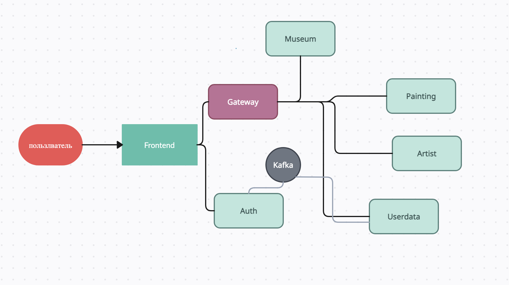

**Дипломный проект Rococo**
#### Cтруктура сервисов:


#### 1. Установить docker (Если не установлен)

После установки и запуска docker daemon необходимо убедиться в работе команд docker, например `docker -v`:

```posh
Dmitriis-MacBook-Pro ~ % docker -v
Docker version 20.10.14, build a224086
```

#### 2. Спуллить контейнер postgres:15.1, zookeeper и kafka версии 7.3.2

```posh
docker pull postgres:15.1
docker pull confluentinc/cp-zookeeper:7.3.2
docker pull confluentinc/cp-kafka:7.3.2
```

#### 3. Создать volume для сохранения данных из БД в docker на вашем компьютере

```posh
docker volume create pgdata
```

#### 4. Запустить БД, zookeeper и kafka 3-мя последовательными командами:

Запустив скрипт

```posh
Dmitriis-MacBook-Pro  rococo % bash localenv.sh
```

#### 5. Установить одну из программ для визуальной работы с Postgres

Например, DBeaver или Datagrip. Мы рекомендуем бесплатную PgAdmin 4.

#### 6. Подключиться к БД postgres (host: localhost, port: 5432, user: postgres, pass: secret, database name: postgres) из PgAdmin и создать пустые БД микросервисов

```sql
create
    database "rococo-userdata" with owner postgres;
create
    database "rococo-artist" with owner postgres;
create
    database "rococo-museum" with owner postgres;
create
    database "rococo-painting" with owner postgres;
create
    database "rococo-auth" with owner postgres;
```

#### 7. Установить Java версии 17 или новее. Это необходимо, т.к. проект не поддерживает версии <17

#### 8. Установить пакетый менеджер для сборки front-end npm

# Запуск Rococo локальное в IDE:

#### 1. Запуск фронтенда

```posh
Dmitriis-MacBook-Pro rococo % cd rococo-client
```
```

#### 2. Запустить фронтенд (сначала обновить зависимости)

Для *nix:

```posh
Dmitriis-MacBook-Pro rococo-client % npm i
Dmitriis-MacBook-Pro rococo-client % npm run build:dev
```

#### 3. Прописать run конфигурацию для всех сервисов rococo-* - Active profiles local

Для этого зайти в меню Run -> Edit Configurations -> выбрать main класс -> указать Active profiles: local
[Инструкция](https://stackoverflow.com/questions/39738901/how-do-i-activate-a-spring-boot-profile-when-running-from-intellij).

#### 4 Запустить сервис Rococo-auth c помощью gradle или командой Run в IDE:
- 

- Запустить сервис auth

```posh
Dmitriis-MacBook-Pro niffler % cd rococo-auth
Dmitriis-MacBook-Pro niffler-auth % gradle bootRun --args='--spring.profiles.active=local'
```

Или просто перейдя к main-классу приложения RococoAuthApplication выбрать run в IDEA (предварительно удостовериться что
выполнен предыдущий пункт)

#### 5  Запустить в любой последовательности другие сервисы

# Запуск Rococo в докере:

#### 1. Создать бесплатную учетную запись на https://hub.docker.com/ (если отсутствует)

#### 2. Создать в настройках своей учетной записи access_token

[Инструкция](https://docs.docker.com/docker-hub/access-tokens/).

#### 3. Выполнить docker login с созданным access_token (в инструкции это описано)

#### 4. Прописать в etc/hosts элиас для Docker-имени

#### frontend:  127.0.0.1 frontend.niffler.dc,

#### auth:      127.0.0.1 auth.niffler.dc

#### gateway:   127.0.0.1 gateway.niffler.dc

```posh
Dmitriis-MacBook-Pro niffler % vi /etc/hosts
```

```posh
##
# Host Database
#
# localhost is used to configure the loopback interface
# when the system is booting.  Do not change this entry.
##
127.0.0.1       localhost
127.0.0.1       frontend.niffler.dc
127.0.0.1       auth.niffler.dc
127.0.0.1       gateway.niffler.dc
```

#### 5. Перейти в корневой каталог проекта

```posh
Dmitriis-MacBook-Pro niffler % cd niffler
```

#### 6. Запустить все сервисы, если необходим фронтенд GraphQL, то это указывается аргументом к скрипту:

для REST:

```posh
Dmitriis-MacBook-Pro  niffler % bash docker-compose-dev.sh
```

для GraphQL:

```posh
Dmitriis-MacBook-Pro  niffler % bash docker-compose-dev.sh gql
```

Текущая версия docker-compose-dev.sh удалит все старые Docker контейнеры в системе, поэтому если у вас есть созданные
контейнеры для других проектов - отредактируйте строку ```posh docker rm $(docker ps -a -q)```, чтобы включить в grep
только те контейнеры, что непосредственно относятся к niffler.

Niffler при запуске в докере будет работать для вас по адресу http://frontend.niffler.dc:80, этот порт НЕ НУЖНО
указывать
в браузере, таким образом переходить напрямую по ссылке http://frontend.niffler.dc

Если при выполнении скрипта вы получили ошибку

```
* What went wrong:
Execution failed for task ':niffler-auth:jibDockerBuild'.
> com.google.cloud.tools.jib.plugins.common.BuildStepsExecutionException: 
Build to Docker daemon failed, perhaps you should make sure your credentials for 'registry-1.docker.io...
```

То необходимо убедиться, что в `$USER/.docker/config.json` файле отсутствует запись `"credsStore": "desktop"`
При наличии такого ключа в json, его надо удалить

# Создание своего docker repository для форка Niffler и сборка своих докер контейнеров

#### 1. Войти в свою УЗ на https://hub.docker.com/ и последовательно создать публичные репозитории

- niffler-frontend
- niffler-frontend-gql
- niffler-userdata
- niffler-spend
- niffler-gateway
- niffler-currency
- niffler-auth

Допустим, что ваш username на https://hub.docker.com - *foobazz*

#### 2. заменить в файле docker.properties (в корне проекта) IMAGE_PREFIX=qaguru на IMAGE_PREFIX=foobazz

- где foobazz - ваш юзернэйм на https://hub.docker.com/

#### 3. заменить в файле build.gradle (в корне проекта) imagePrefix = "qaguru" на imagePrefix = "foobazz"

- где foobazz - ваш юзернэйм на https://hub.docker.com/

#### 4. Перейти в корневой каталог проекта

```posh
Dmitriis-MacBook-Pro niffler % cd niffler
```

#### 5. Собрать все имеджи, запушить и запустить niffler одной командой, если необходим фронтенд GraphQL, то это указывается аргументом к скрипту:

для REST:

```posh
Dmitriis-MacBook-Pro  niffler % bash docker-compose-dev.sh push
```

для GraphQL:

```posh
Dmitriis-MacBook-Pro  niffler % bash docker-compose-dev.sh gql push
```

# Запуск e-2-e тестов в Docker network изолированно Niffler в докере:

#### 1. Перейти в корневой каталог проекта

```posh
Dmitriis-MacBook-Pro niffler % cd niffler
```

#### 2. Запустить все сервисы и тесты, если необходим фронтенд GraphQL, то это указывается аргументом к скрипту:

для REST:

```posh
Dmitriis-MacBook-Pro  niffler % bash docker-compose-e2e.sh
```

для GraphQL:

```posh
Dmitriis-MacBook-Pro  niffler % bash docker-compose-e2e.sh gql
```

#### 3. Selenoid UI доступен по адресу: http://localhost:9090/

#### 4. Allure доступен по адресу: http://localhost:5050/allure-docker-service/projects/niffler-e-2-e-tests/reports/latest/index.html


